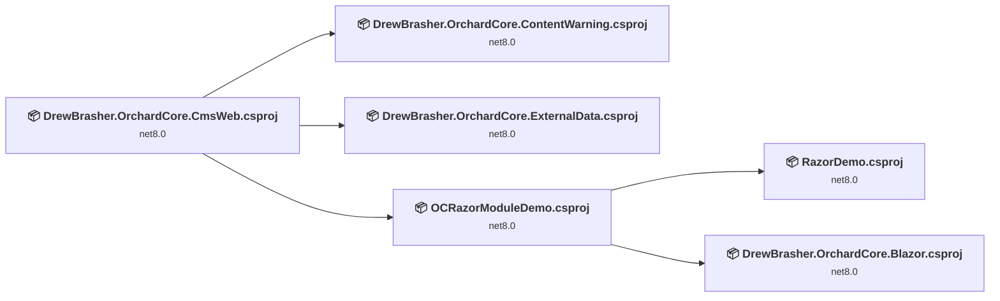
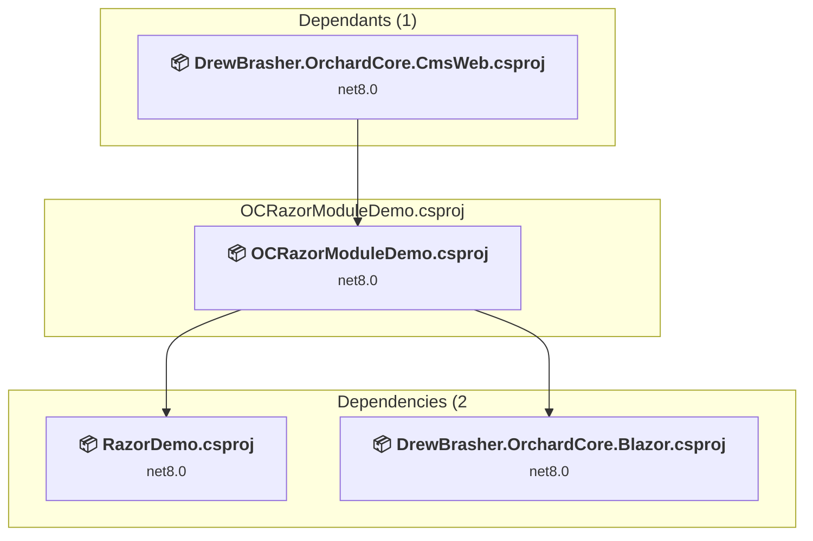
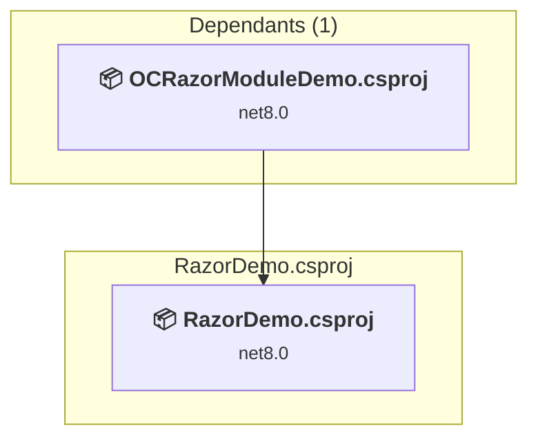
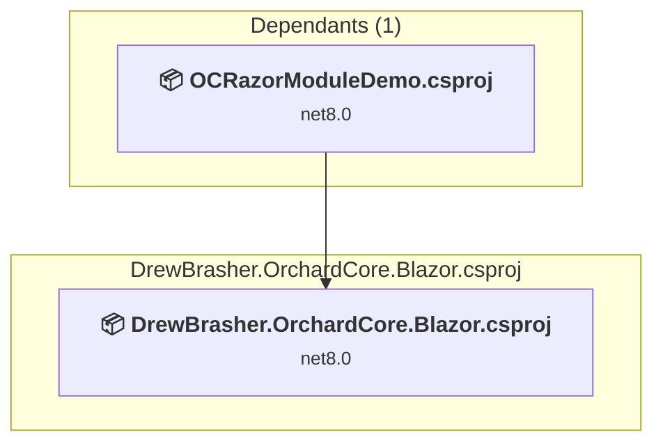
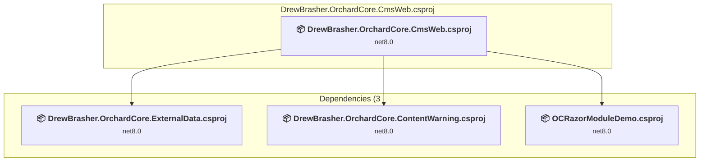
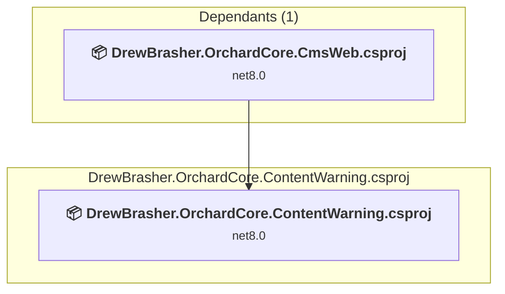
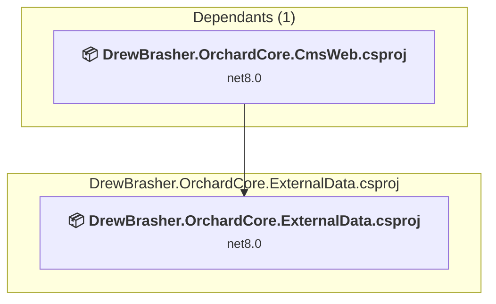

# Projects and dependencies analysis

This document provides a comprehensive overview of the projects and their dependencies in the context of upgrading to .NETCoreApp,Version=v10.0.

## Table of Contents

- [Executive Summary](#executive-Summary)
  - [Highlevel Metrics](#highlevel-metrics)
  - [Projects Compatibility](#projects-compatibility)
  - [Package Compatibility](#package-compatibility)
  - [API Compatibility](#api-compatibility)
- [Aggregate NuGet packages details](#aggregate-nuget-packages-details)
- [Top API Migration Challenges](#top-api-migration-challenges)
  - [Technologies and Features](#technologies-and-features)
  - [Most Frequent API Issues](#most-frequent-api-issues)
- [Projects Relationship Graph](#projects-relationship-graph)
- [Project Details](#project-details)

  - [Demo\OCRazorModuleDemo\OCRazorModuleDemo.csproj](#demoocrazormoduledemoocrazormoduledemocsproj)
  - [Demo\RazorDemo\RazorDemo.csproj](#demorazordemorazordemocsproj)
  - [DrewBrasher.OrchardCore.Blazor\DrewBrasher.OrchardCore.Blazor.csproj](#drewbrasherorchardcoreblazordrewbrasherorchardcoreblazorcsproj)
  - [DrewBrasher.OrchardCore.CmsWeb\DrewBrasher.OrchardCore.CmsWeb.csproj](#drewbrasherorchardcorecmswebdrewbrasherorchardcorecmswebcsproj)
  - [DrewBrasher.OrchardCore.ContentWarning\DrewBrasher.OrchardCore.ContentWarning.csproj](#drewbrasherorchardcorecontentwarningdrewbrasherorchardcorecontentwarningcsproj)
  - [DrewBrasher.OrchardCore.ExternalData\DrewBrasher.OrchardCore.ExternalData.csproj](#drewbrasherorchardcoreexternaldatadrewbrasherorchardcoreexternaldatacsproj)

## Executive Summary

### Highlevel Metrics

| Metric | Count | Status |
| :--- | :---: | :--- |
| Total Projects | 6 | All require upgrade |
| Total NuGet Packages | 15 | 1 need upgrade |
| Total Code Files | 23 |  |
| Total Code Files with Incidents | 9 |  |
| Total Lines of Code | 757 |  |
| Total Number of Issues | 10 |  |
| Estimated LOC to modify | 3+ | at least 0.4% of codebase |

### Projects Compatibility

| Project | Target Framework | Difficulty | Package Issues | API Issues | Est. LOC Impact | Description |
| :--- | :---: | :---: | :---: | :---: | :---: | :--- |
| [Demo\OCRazorModuleDemo\OCRazorModuleDemo.csproj](#demoocrazormoduledemoocrazormoduledemocsproj) | net8.0 | 🟢 Low | 0 | 0 |  | ClassLibrary, Sdk Style = True |
| [Demo\RazorDemo\RazorDemo.csproj](#demorazordemorazordemocsproj) | net8.0 | 🟢 Low | 1 | 0 |  | ClassLibrary, Sdk Style = True |
| [DrewBrasher.OrchardCore.Blazor\DrewBrasher.OrchardCore.Blazor.csproj](#drewbrasherorchardcoreblazordrewbrasherorchardcoreblazorcsproj) | net8.0 | 🟢 Low | 0 | 0 |  | ClassLibrary, Sdk Style = True |
| [DrewBrasher.OrchardCore.CmsWeb\DrewBrasher.OrchardCore.CmsWeb.csproj](#drewbrasherorchardcorecmswebdrewbrasherorchardcorecmswebcsproj) | net8.0 | 🟢 Low | 0 | 1 | 1+ | AspNetCore, Sdk Style = True |
| [DrewBrasher.OrchardCore.ContentWarning\DrewBrasher.OrchardCore.ContentWarning.csproj](#drewbrasherorchardcorecontentwarningdrewbrasherorchardcorecontentwarningcsproj) | net8.0 | 🟢 Low | 0 | 0 |  | ClassLibrary, Sdk Style = True |
| [DrewBrasher.OrchardCore.ExternalData\DrewBrasher.OrchardCore.ExternalData.csproj](#drewbrasherorchardcoreexternaldatadrewbrasherorchardcoreexternaldatacsproj) | net8.0 | 🟢 Low | 0 | 2 | 2+ | ClassLibrary, Sdk Style = True |

### Package Compatibility

| Status | Count | Percentage |
| :--- | :---: | :---: |
| ✅ Compatible | 14 | 93.3% |
| ⚠️ Incompatible | 0 | 0.0% |
| 🔄 Upgrade Recommended | 1 | 6.7% |
| ***Total NuGet Packages*** | ***15*** | ***100%*** |

### API Compatibility

| Category | Count | Impact |
| :--- | :---: | :--- |
| 🔴 Binary Incompatible | 0 | High - Require code changes |
| 🟡 Source Incompatible | 0 | Medium - Needs re-compilation and potential conflicting API error fixing |
| 🔵 Behavioral change | 3 | Low - Behavioral changes that may require testing at runtime |
| ✅ Compatible | 1715 |  |
| ***Total APIs Analyzed*** | ***1718*** |  |

## Aggregate NuGet packages details

| Package | Current Version | Suggested Version | Projects | Description |
| :--- | :---: | :---: | :--- | :--- |
| Lombiq.HelpfulExtensions | 11.0.0 |  | [DrewBrasher.OrchardCore.CmsWeb.csproj](#drewbrasherorchardcorecmswebdrewbrasherorchardcorecmswebcsproj) | ✅Compatible |
| Microsoft.AspNetCore.Components.Web | 8.0.14 | 10.0.1 | [RazorDemo.csproj](#demorazordemorazordemocsproj) | NuGet package upgrade is recommended |
| OrchardCore.Application.Cms.Targets | 2.1.6 |  | [DrewBrasher.OrchardCore.CmsWeb.csproj](#drewbrasherorchardcorecmswebdrewbrasherorchardcorecmswebcsproj) | ✅Compatible |
| OrchardCore.ContentManagement | 1.8.3 |  | [DrewBrasher.OrchardCore.ContentWarning.csproj](#drewbrasherorchardcorecontentwarningdrewbrasherorchardcorecontentwarningcsproj) [DrewBrasher.OrchardCore.ExternalData.csproj](#drewbrasherorchardcoreexternaldatadrewbrasherorchardcoreexternaldatacsproj) | ✅Compatible |
| OrchardCore.ContentManagement | 2.1.6 |  | [DrewBrasher.OrchardCore.Blazor.csproj](#drewbrasherorchardcoreblazordrewbrasherorchardcoreblazorcsproj) [OCRazorModuleDemo.csproj](#demoocrazormoduledemoocrazormoduledemocsproj) | ✅Compatible |
| OrchardCore.ContentTypes.Abstractions | 1.8.3 |  | [DrewBrasher.OrchardCore.ContentWarning.csproj](#drewbrasherorchardcorecontentwarningdrewbrasherorchardcorecontentwarningcsproj) [DrewBrasher.OrchardCore.ExternalData.csproj](#drewbrasherorchardcoreexternaldatadrewbrasherorchardcoreexternaldatacsproj) | ✅Compatible |
| OrchardCore.ContentTypes.Abstractions | 2.1.6 |  | [DrewBrasher.OrchardCore.Blazor.csproj](#drewbrasherorchardcoreblazordrewbrasherorchardcoreblazorcsproj) [OCRazorModuleDemo.csproj](#demoocrazormoduledemoocrazormoduledemocsproj) | ✅Compatible |
| OrchardCore.DisplayManagement | 1.8.3 |  | [DrewBrasher.OrchardCore.ContentWarning.csproj](#drewbrasherorchardcorecontentwarningdrewbrasherorchardcorecontentwarningcsproj) [DrewBrasher.OrchardCore.ExternalData.csproj](#drewbrasherorchardcoreexternaldatadrewbrasherorchardcoreexternaldatacsproj) | ✅Compatible |
| OrchardCore.DisplayManagement | 2.1.6 |  | [DrewBrasher.OrchardCore.Blazor.csproj](#drewbrasherorchardcoreblazordrewbrasherorchardcoreblazorcsproj) [OCRazorModuleDemo.csproj](#demoocrazormoduledemoocrazormoduledemocsproj) | ✅Compatible |
| OrchardCore.Infrastructure | 1.8.3 |  | [DrewBrasher.OrchardCore.ContentWarning.csproj](#drewbrasherorchardcorecontentwarningdrewbrasherorchardcorecontentwarningcsproj) | ✅Compatible |
| OrchardCore.Logging.NLog | 2.1.6 |  | [DrewBrasher.OrchardCore.CmsWeb.csproj](#drewbrasherorchardcorecmswebdrewbrasherorchardcorecmswebcsproj) | ✅Compatible |
| OrchardCore.Markdown.Abstractions | 1.8.3 |  | [DrewBrasher.OrchardCore.ExternalData.csproj](#drewbrasherorchardcoreexternaldatadrewbrasherorchardcoreexternaldatacsproj) | ✅Compatible |
| OrchardCore.Module.Targets | 1.8.3 |  | [DrewBrasher.OrchardCore.ContentWarning.csproj](#drewbrasherorchardcorecontentwarningdrewbrasherorchardcorecontentwarningcsproj) [DrewBrasher.OrchardCore.ExternalData.csproj](#drewbrasherorchardcoreexternaldatadrewbrasherorchardcoreexternaldatacsproj) | ✅Compatible |
| OrchardCore.Module.Targets | 2.1.6 |  | [DrewBrasher.OrchardCore.Blazor.csproj](#drewbrasherorchardcoreblazordrewbrasherorchardcoreblazorcsproj) [OCRazorModuleDemo.csproj](#demoocrazormoduledemoocrazormoduledemocsproj) | ✅Compatible |
| OrchardCore.Shortcodes.Abstractions | 1.8.3 |  | [DrewBrasher.OrchardCore.ContentWarning.csproj](#drewbrasherorchardcorecontentwarningdrewbrasherorchardcorecontentwarningcsproj) [DrewBrasher.OrchardCore.ExternalData.csproj](#drewbrasherorchardcoreexternaldatadrewbrasherorchardcoreexternaldatacsproj) | ✅Compatible |

## Top API Migration Challenges

### Technologies and Features

| Technology | Issues | Percentage | Migration Path |
| :--- | :---: | :---: | :--- |

### Most Frequent API Issues

| API | Count | Percentage | Category |
| :--- | :---: | :---: | :--- |
| M:Microsoft.AspNetCore.Builder.ExceptionHandlerExtensions.UseExceptionHandler(Microsoft.AspNetCore.Builder.IApplicationBuilder,System.String) | 1 | 33.3% | Behavioral Change |
| T:System.Net.Http.HttpContent | 1 | 33.3% | Behavioral Change |
| M:Microsoft.Extensions.DependencyInjection.HttpClientFactoryServiceCollectionExtensions.AddHttpClient(Microsoft.Extensions.DependencyInjection.IServiceCollection) | 1 | 33.3% | Behavioral Change |

## Projects Relationship Graph

Legend:
📦 SDK-style project
⚙️ Classic project

## Project Details

### Demo\OCRazorModuleDemo\OCRazorModuleDemo.csproj

#### Project Info

- **Current Target Framework:** net8.0
- **Proposed Target Framework:** net10.0
- **SDK-style**: True
- **Project Kind:** ClassLibrary
- **Dependencies**: 2
- **Dependants**: 1
- **Number of Files**: 7
- **Number of Files with Incidents**: 1
- **Lines of Code**: 89
- **Estimated LOC to modify**: 0+ (at least 0.0% of the project)

#### Dependency Graph

Legend:
📦 SDK-style project
⚙️ Classic project

### API Compatibility

| Category | Count | Impact |
| :--- | :---: | :--- |
| 🔴 Binary Incompatible | 0 | High - Require code changes |
| 🟡 Source Incompatible | 0 | Medium - Needs re-compilation and potential conflicting API error fixing |
| 🔵 Behavioral change | 0 | Low - Behavioral changes that may require testing at runtime |
| ✅ Compatible | 253 |  |
| ***Total APIs Analyzed*** | ***253*** |  |

### Demo\RazorDemo\RazorDemo.csproj

#### Project Info

- **Current Target Framework:** net8.0
- **Proposed Target Framework:** net10.0
- **SDK-style**: True
- **Project Kind:** ClassLibrary
- **Dependencies**: 0
- **Dependants**: 1
- **Number of Files**: 5
- **Number of Files with Incidents**: 1
- **Lines of Code**: 36
- **Estimated LOC to modify**: 0+ (at least 0.0% of the project)

#### Dependency Graph

Legend:
📦 SDK-style project
⚙️ Classic project

### API Compatibility

| Category | Count | Impact |
| :--- | :---: | :--- |
| 🔴 Binary Incompatible | 0 | High - Require code changes |
| 🟡 Source Incompatible | 0 | Medium - Needs re-compilation and potential conflicting API error fixing |
| 🔵 Behavioral change | 0 | Low - Behavioral changes that may require testing at runtime |
| ✅ Compatible | 84 |  |
| ***Total APIs Analyzed*** | ***84*** |  |

### DrewBrasher.OrchardCore.Blazor\DrewBrasher.OrchardCore.Blazor.csproj

#### Project Info

- **Current Target Framework:** net8.0
- **Proposed Target Framework:** net10.0
- **SDK-style**: True
- **Project Kind:** ClassLibrary
- **Dependencies**: 0
- **Dependants**: 1
- **Number of Files**: 10
- **Number of Files with Incidents**: 1
- **Lines of Code**: 253
- **Estimated LOC to modify**: 0+ (at least 0.0% of the project)

#### Dependency Graph

Legend:
📦 SDK-style project
⚙️ Classic project

### API Compatibility

| Category | Count | Impact |
| :--- | :---: | :--- |
| 🔴 Binary Incompatible | 0 | High - Require code changes |
| 🟡 Source Incompatible | 0 | Medium - Needs re-compilation and potential conflicting API error fixing |
| 🔵 Behavioral change | 0 | Low - Behavioral changes that may require testing at runtime |
| ✅ Compatible | 643 |  |
| ***Total APIs Analyzed*** | ***643*** |  |

### DrewBrasher.OrchardCore.CmsWeb\DrewBrasher.OrchardCore.CmsWeb.csproj

#### Project Info

- **Current Target Framework:** net8.0
- **Proposed Target Framework:** net10.0
- **SDK-style**: True
- **Project Kind:** AspNetCore
- **Dependencies**: 3
- **Dependants**: 0
- **Number of Files**: 16
- **Number of Files with Incidents**: 2
- **Lines of Code**: 30
- **Estimated LOC to modify**: 1+ (at least 3.3% of the project)

#### Dependency Graph

Legend:
📦 SDK-style project
⚙️ Classic project

### API Compatibility

| Category | Count | Impact |
| :--- | :---: | :--- |
| 🔴 Binary Incompatible | 0 | High - Require code changes |
| 🟡 Source Incompatible | 0 | Medium - Needs re-compilation and potential conflicting API error fixing |
| 🔵 Behavioral change | 1 | Low - Behavioral changes that may require testing at runtime |
| ✅ Compatible | 37 |  |
| ***Total APIs Analyzed*** | ***38*** |  |

### DrewBrasher.OrchardCore.ContentWarning\DrewBrasher.OrchardCore.ContentWarning.csproj

#### Project Info

- **Current Target Framework:** net8.0
- **Proposed Target Framework:** net10.0
- **SDK-style**: True
- **Project Kind:** ClassLibrary
- **Dependencies**: 0
- **Dependants**: 1
- **Number of Files**: 15
- **Number of Files with Incidents**: 1
- **Lines of Code**: 262
- **Estimated LOC to modify**: 0+ (at least 0.0% of the project)

#### Dependency Graph

Legend:
📦 SDK-style project
⚙️ Classic project

### API Compatibility

| Category | Count | Impact |
| :--- | :---: | :--- |
| 🔴 Binary Incompatible | 0 | High - Require code changes |
| 🟡 Source Incompatible | 0 | Medium - Needs re-compilation and potential conflicting API error fixing |
| 🔵 Behavioral change | 0 | Low - Behavioral changes that may require testing at runtime |
| ✅ Compatible | 623 |  |
| ***Total APIs Analyzed*** | ***623*** |  |

### DrewBrasher.OrchardCore.ExternalData\DrewBrasher.OrchardCore.ExternalData.csproj

#### Project Info

- **Current Target Framework:** net8.0
- **Proposed Target Framework:** net10.0
- **SDK-style**: True
- **Project Kind:** ClassLibrary
- **Dependencies**: 0
- **Dependants**: 1
- **Number of Files**: 4
- **Number of Files with Incidents**: 3
- **Lines of Code**: 87
- **Estimated LOC to modify**: 2+ (at least 2.3% of the project)

#### Dependency Graph

Legend:
📦 SDK-style project
⚙️ Classic project

### API Compatibility

| Category | Count | Impact |
| :--- | :---: | :--- |
| 🔴 Binary Incompatible | 0 | High - Require code changes |
| 🟡 Source Incompatible | 0 | Medium - Needs re-compilation and potential conflicting API error fixing |
| 🔵 Behavioral change | 2 | Low - Behavioral changes that may require testing at runtime |
| ✅ Compatible | 75 |  |
| ***Total APIs Analyzed*** | ***77*** |  |

